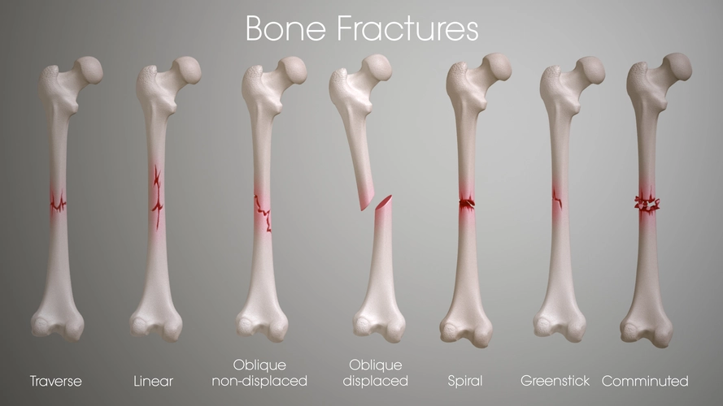

# <h1 align="center">**Bone Fracture Detection**<h1>

 

    

 

## Introduction

The Bone Fracture Detection dashboard app leverages Machine Learning to allow users to upload bone images, identify whether the bone is healthy or fractured, and download a detailed report of the analysis.

[Click here to visit this project on Heroku.]()

 

## Content

- [Business Requirements](#business-requirements)
- [Hypothesis and how to Validate](#hypothesis-and-how-to-validate)
- [Business Rationale](#business-rationale)
- [ML Business Case](#ml-business-case)
- [User Stories](#user-stories)
- [Methodology](#methodology)
- [Rationale for the Model](#rationale-for-the-model)
- [Dashboard Design](#dashboard-design)
- [Features](#features)
- [Project Outcomes](#project-outcomes)
- [Hypothesis Outcomes](#hypothesis-outcomes)
- [Languages and Libraries](#languages-and-libraries)
- [Testing](#testing)
- [Bugs](#bugs)
    * [Fixed Bugs](#fixed-bugs)
    * [Unfixed Bugs](#unfixed-bugs)
- [Deployment](#deployment)
    * [Github Deployment](#github-deployment)
    * [Heroku Deployment](#heroku-deployment)
- [Credits](#credits)

 

## Business Requirements

The Tirol Hospital in Austria, located near numerous popular ski areas, has been experiencing a high influx of patients with fractured bones. This surge is largely attributed to the skiing activities in the region, which inherently come with a risk of injuries. 

To address the growing number of cases more efficiently, the hospital wants to implement a machine learning system to expedite the process of diagnosing fractures. Currently, the verification of bone fractures is performed manually by medical professionals, a method that is not only time-consuming but also costly. 

By integrating a machine learning system, the hospital aims to streamline the diagnostic process, thereby saving valuable time and reducing operational costs. This technological advancement is expected to enhance the overall efficiency of patient care at the hospital.

**Summary :**
- The client is interested in conducting a study to visually differentiate a unfractured bone from one with a fracture.
- The client is interested in a dashboard that predicts if a bone is fractured or not with a 97% accuracy.

[Back to Top](#content)

 

## Hypothesis and how to Validate

Implementing a machine learning model trained on medical imaging data will improve the accuracy and efficiency of detecting bone fractures compared to traditional manual diagnosis methods.

- Fractured bones can be distinguished from healthy ones by their distinctive appearance.
    * This can be verified by creating an average image study and image montage to determine differences in the appearance of healthy bones and fractured bones.
- Bones can be determined to be healthy or fractured with a degree of 97% accuracy.
    * This can be verified by evaluating the model on the test dataset, which should achieve at least 97% accuracy.
- If the image uploaded contains colours, the model will predict false results.
    * This can be verified by testing the model with new pictures of bones that contains colours, since the dataset images are only in black, white and grey. Use x-ray images that contain only black, white and grey.

[Back to Top](#content)

 

## Business Rationale

Rationale to map the business requirements to the Data Visualizations and ML tasks.

- **Business Requirement 1 :** Data Visualization
  * The images depicting the 'mean' and 'standard deviation' for both healthy bones and fractured bones will be shown on the dashboard.
  * The visual distinction between a typical healthy bone and a typical fractured bone will be visualized on the dashboard.
  * A collection of images showcasing both healthy bones and fractured bones will be visualized on the dashboard.

- **Business Requirement 2 :** Classification
  * Develop and train a machine learning model designed to classify bones as either healthy or fractured. This task involves binary classification and requires defining the image dimensions.
  * The predictions should have a 97% accuracy level.

- **Business Requirement 3 :** Report
  * You can access and download a report containing the predicted status of all uploaded images.

[Back to Top](#content)

 

## ML Business Case

The Bone Fracture Detection project aims to leverage machine learning (ML) to enhance the efficiency and accuracy of diagnosing bone fractures. Currently, the process relies heavily on manual inspection, which is time-consuming and prone to human error. By implementing an ML model trained on medical imaging data, the project seeks to automate and streamline this critical diagnostic procedure.

**Objectives :**
- **Enhanced Diagnostic Accuracy :** Reduce the incidence of missed fractures and false diagnoses through automated analysis of medical images.
- **Improved Efficiency :** Expedite the diagnosis process, enabling healthcare professionals to make timely treatment decisions.
- **Cost Efficiency :** Decrease operational costs associated with manual verification and potential re-evaluations.

**Value Proposition :**
- **Accurate and Timely Diagnosis :** Provide healthcare providers with a reliable tool to swiftly identify fractures, facilitating prompt patient care.
- **Operational Efficiency :** Streamline workflow processes by reducing manual effort and improving resource allocation.
- **Cost Savings:** Minimize the expenses related to extended diagnosis times and potential inaccuracies.

**Implementation Strategy :**
- **Data Collection and Annotation :** Gather a diverse dataset of medical images annotated by experts to train the ML model. The dataset can be found on [Kaggle](https://www.kaggle.com/datasets/bmadushanirodrigo/fracture-multi-region-x-ray-data/data). The dataset contains 10,580 radiographic images (X-ray) taken at the client's hospital. The images show healthy bones and fractured bones.
- **Model Development :** Develop and optimize an ML algorithm capable of accurately detecting and classifying bone fractures from images.
- **Validation and Testing :** Validate the model's performance using rigorous testing protocols, including cross-validation and external validation with unseen data. The model will be successful if an accuracy of at least 97% is obtained on the test set.
- **Deployment and Integration :** Integrate the ML model into an dashboard app on [Heroku](https://www.heroku.com/) to support seamless adoption by medical professionals.
- **Monitoring and Iteration :** Continuously monitor model performance, gather feedback from users, and iterate to improve accuracy and reliability.

The Bone Fracture Detection project represents a strategic initiative to leverage ML technology for improving healthcare outcomes. By automating fracture diagnosis, the project aims to enhance diagnostic accuracy, operational efficiency, and overall patient care while reducing costs associated with manual processes.

[Back to Top](#content)

 

## User Stories

- **As a medical professional** : 
    * I want to use a machine learning app to assist in identifying fractures from medical images, so that I can improve the accuracy and speed of my diagnoses.
    * I desire a straightforward and user-friendly dashboard application.
    * I seek to examine the average and variability images of both healthy bones and fractured bones to facilitate visual differentiation between these two classifications.
    * I aim to observe the disparity between an average healthy bone and an average fractured bone in order to visually distinguish between the two classifications.
    * I would like to review an image montage displaying both healthy bones and fractured bones, allowing me to visually discern between the two classifications.
    * I seek to upload bone images and receive classifications with over 97% accuracy, enabling rapid identification of whether the bones are healthy or fractured.
    * I want a downloadable report containing the predictions made, ensuring that I have a record of the predicted outcomes.
- **As a Patient** : 
    * I expect accurate and reliable diagnoses. The ML app can assist medical professionals in achieving more precise assessments, reducing the likelihood of misdiagnosis or oversight.
    * I want swift detection of fractures through the ML app to expedite treatment planning and intervention, potentially leading to faster recovery and improved outcomes for patients.
    * I want the app's predictions to serve as an additional diagnostic tool that supports and validates clinical assessments, fostering confidence in treatment decisions.

[Back to Top](#content)

 

## Methodology

The **CRISP-DM** methodology was pivotal in guiding this Bone Fracture Detection project through its phases :

1. **Business Understanding :**
   - Defined the project objectives to improve bone fracture diagnosis accuracy and efficiency using machine learning.
   - Identified stakeholders needs, seeking faster and more reliable fracture detection.

2. **Data Understanding :**
   - Gathered diverse datasets of medical images, including both healthy bones and fractured bones.
   - Conducted exploratory data analysis (EDA) to understand data distributions and characteristics.

3. **Data Preparation :**
   - Cleaned and preprocessed the data to ensure consistency and quality.
   - Extracted relevant features from the images and formatted them for machine learning model input.

4. **Modeling :**
   - Selected appropriate machine learning algorithms for binary classification of healthy versus fractured bones.
   - Trained multiple models using the prepared data, experimenting with different algorithms and hyperparameters.

5. **Evaluation :**
   - Evaluated model performance using metrics such as accuracy, precision, recall, and F1-score.
   - Used cross-validation techniques to assess model robustness and generalization to new data.

6. **Deployment :**
   - Integrated the best-performing model into a user-friendly application.
   - Ensured a working Heroku application for seamless adoption by medical professionals.

 

    

 

I employed the **Agile** methodology to ensure a flexible and iterative development process. By breaking the project into manageable sprints, I was able to continuously integrate feedback and make incremental improvements. Each sprint focused on specific tasks, such as data preprocessing, model training, and evaluation, allowing for regular assessments and adjustments. This approach facilitated close collaboration with stakeholders, enabling us to swiftly respond to their needs and incorporate their insights into the development cycle. The Agile methodology proved instrumental in delivering a robust and user-centric bone fracture detection system efficiently and effectively.

[Back to Top](#content)

 

## Rationale for the Model

[Back to Top](#content)

 

## Dashboard Design

[Back to Top](#content)

 

## Features

[Back to Top](#content)

 

## Project Outcomes

[Back to Top](#content)

 

## Hypothesis Outcomes

[Back to Top](#content)

 

## Languages and Libraries

This project was written in Python.

Main Data Analysis and Machine Learning :

- **[GitHub](https://github.com/)** was used for version control and agile methodology.
- **[GitPod](https://www.gitpod.io/)** was the workspace used for this project.
- **[Heroku](https://www.heroku.com/)** was used to deploy the site.
- **[Kaggle](https://www.kaggle.com/)** was the source of the dataset.
- **[Jupyter Notebook](https://jupyter.org/)** was used to run the machine learning pipeline.

- **[numpy](https://numpy.org/)** 
- **[pandas](https://pandas.pydata.org/)** 
- **[matplotlib](https://matplotlib.org/)** 
- **[seaborn](https://seaborn.pydata.org/)** 
- **[plotly](https://plotly.com/)** 
- **[streamlit](https://streamlit.io/)** was used to display the dashboard
- **[scikit-learn](https://scikit-learn.org/stable/)** 
- **[tensorflow](https://www.tensorflow.org/)** 
- **[keras](https://keras.io/)** 

[Back to Top](#content)

 

## Testing

[Back to Top](#content)

 

## Bugs

### Fixed Bugs

Image bug :

- The images from the dataset were different types of images so I had to change all the images to the same file extention and change them all to RGB

Save image bug :

- In the data visualisation notebook, there was a bug that only the average fractured image was saving. This was because I needed to add an indentation on the last if statement.

Confusion Matrix bug :

- The matrix was returning incorrectly. 

### Unfixed Bugs

The dataset that I downloaded contains duplicate images in the presplit train, validation and test folders. If I were to join them and then split up again, some of the folders will contain duplicate files that are differently named. I tried looking for a different dataset but was unsuccesfull. I will continue trying to find a good dataset or delete the duplicates.

[Back to Top](#content)

 

## Deployment

### Heroku deployment

- The App live link is: ``
- Set the runtime.txt Python version to a [Heroku-20](https://devcenter.heroku.com/articles/python-support#supported-runtimes) stack currently supported version.
- The project was deployed to Heroku using the following steps.

To deploy Your App to Heroku, you have to :
- Create a Heroku account.
- From the dashboard select create new app.
- Enter a name for your app, it needs to be unique, and select your region then press create app.
- Select settings at the top of your app page.
- Press reveal config vars.
- If the user is using google sheets in their project, you'll have to name your credentials file in the key input and copy and paste that credential file in the value input.
- Also add PORT in key input and 8000 as value input.
- Scroll down and press the add buildpack button.
- From here press the Python icon and then the add buildpack button.
- Add another builpack and press the Nodejs icon this time and then press add buildpack button again.
- Scroll back up and select Deploy at the top of your app page.
- Choose your deployment method, when choosing Github, you will have to connect to your account.
- Then choose which repo you want to deploy and connect to it.
- Choose if you want to deploy automatic or manual, and press deploy.

### Github deployment

To fork this repository on Github, you have to :
  - Go to my [GitHub repository called PP4](https://github.com/ObiWanBonobi/PP4).
  - In the top-right corner of the page, click Fork.
  - Under "Owner," select the dropdown menu and click an owner for the forked repository.
  - By default, forks are named the same as their upstream repositories. Optionally, to further distinguish your fork, in the "Repository name" field, type a name.
  - Click Create fork.

To clone this repository, you have to :
  - Go to my [GitHub repository called PP4](https://github.com/ObiWanBonobi/PP4).
  - Above the list of files, click  Code.
  - Copy the URL for the repository.
  - Open Git Bash.
  - Change the current working directory to the location where you want the cloned directory.
  - Type git clone, and then paste the URL you copied earlier.
  - Press Enter to create your local clone.

You can see the deployed blog [here](https://prof-oaks-blog-0421d28e5692.herokuapp.com/).

[Back to Top](#content)

 

## Credits

### Content

- The Code Institute [Malaria Detector project](https://github.com/Code-Institute-Solutions/WalkthroughProject01) and the [Mildew Detection project](https://github.com/Porsil/mildew_detection_in_cherry_leaves) were used as a reference when creating this project.
- The readme template and layout comes from the Code Institute [Mildew Detection project](https://github.com/Porsil/mildew_detection_in_cherry_leaves).
- I used ChatGPT to help refine my wording. 

### Media

- The Readme image is from this website: 
  * [Fractured bones image](https://lynxfreesm.shop/product_details/58369015.html)
  * [CRISP-DM image](https://quizlet.com/294902465/crisp-dm-diagram/)

[Back to Top](#content)