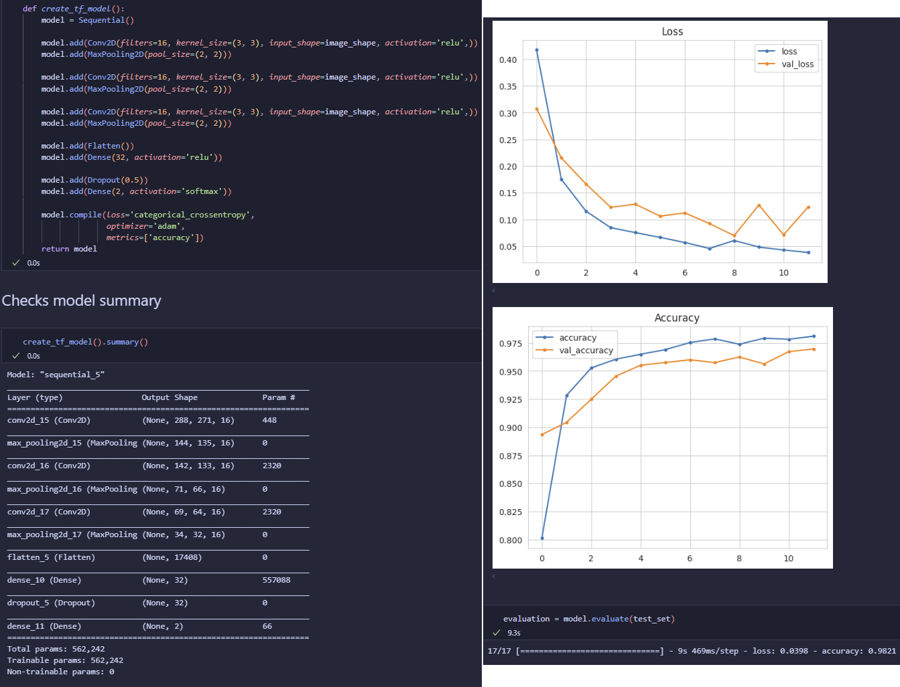

# <h1 align="center">**Bone Fracture Detection**<h1>

 

    

 

## Introduction

The Bone Fracture Detection dashboard app leverages Machine Learning to allow users to upload bone images, identify whether the bone is healthy or fractured, and download a detailed report of the analysis.

[Click here to visit this project on Heroku.](https://bone-fracture-detector-17d0aeeaa391.herokuapp.com/)

 

## Content

- [Business Requirements](#business-requirements)
- [Hypothesis and how to Validate](#hypothesis-and-how-to-validate)
- [Business Rationale](#business-rationale)
- [ML Business Case](#ml-business-case)
- [User Stories](#user-stories)
- [Methodology](#methodology)
- [Rationale for the Model](#rationale-for-the-model)
- [Dashboard Design](#dashboard-design)
- [Features](#features)
- [Project Outcomes](#project-outcomes)
- [Hypothesis Outcomes](#hypothesis-outcomes)
- [Languages and Libraries](#languages-and-libraries)
- [Testing](#testing)
- [Bugs](#bugs)
    * [Fixed Bugs](#fixed-bugs)
    * [Unfixed Bugs](#unfixed-bugs)
- [Deployment](#deployment)
    * [Github Deployment](#github-deployment)3
    * [Heroku Deployment](#heroku-deployment)
- [Credits](#credits)

 

## Business Requirements

The Tirol Hospital in Austria, located near numerous popular ski areas, has been experiencing a high influx of patients with fractured bones. This surge is largely attributed to the skiing activities in the region, which inherently come with a risk of injuries. 

To address the growing number of cases more efficiently, the hospital wants to implement a machine learning system to expedite the process of diagnosing fractures. Currently, the verification of bone fractures is performed manually by medical professionals, a method that is not only time-consuming but also costly. 

By integrating a machine learning system, the hospital aims to streamline the diagnostic process, thereby saving valuable time and reducing operational costs. This technological advancement is expected to enhance the overall efficiency of patient care at the hospital.

**Summary :**
- The client is interested in conducting a study to visually differentiate a unfractured bone from one with a fracture.
- The client is interested in a dashboard that predicts if a bone is fractured or not.
- The client would like the dashboard to predict if a bone is healthy or fractured with a 97% accuracy.

[Back to Top](#content)

 

## Hypothesis and how to Validate

Implementing a machine learning model trained on medical imaging data will improve the accuracy and efficiency of detecting bone fractures compared to traditional manual diagnosis methods.

- Fractured bones can be distinguished from healthy ones by their distinctive appearance.
    * This can be verified by creating an average image study and image montage to determine differences in the appearance of healthy bones and fractured bones.
- Bones can be determined to be healthy or fractured with a degree of 97% accuracy.
    * This can be verified by evaluating the model on the test dataset, which should achieve at least 97% accuracy.
- If the x-ray image uploaded is anything other than the usual black background, the model will predict false results.
    * This can be verified by testing the model with new x-ray images that have a white background. Use x-ray images that have a black background.

[Back to Top](#content)

 

## Business Rationale

Rationale to map the business requirements to the Data Visualizations and ML tasks.

- **Business Requirement 1 :** Data Visualization
  * The images depicting the 'mean' and 'standard deviation' for both healthy bones and fractured bones will be shown on the dashboard.
  * The visual distinction between a typical healthy bone and a typical fractured bone will be visualized on the dashboard.
  * A collection of images showcasing both healthy bones and fractured bones will be visualized on the dashboard.

- **Business Requirement 2 :** Classification
  * Develop and train a machine learning model designed to classify bones as either healthy or fractured. This task involves categorical classification and requires defining the image dimensions.
  * The predictions should have a 97% accuracy level.

- **Business Requirement 3 :** Report
  * You can access and download a report containing the predicted status of all uploaded images.

[Back to Top](#content)

 

## ML Business Case

The Bone Fracture Detection project aims to leverage machine learning (ML) to enhance the efficiency and accuracy of diagnosing bone fractures. Currently, the process relies heavily on manual inspection, which is time-consuming and prone to human error. By implementing an ML model trained on medical imaging data, the project seeks to automate and streamline this critical diagnostic procedure.

**Objectives :**
- **Enhanced Diagnostic Accuracy :** Reduce the incidence of missed fractures and false diagnoses through automated analysis of medical images.
- **Improved Efficiency :** Expedite the diagnosis process, enabling healthcare professionals to make timely treatment decisions.
- **Cost Efficiency :** Decrease operational costs associated with manual verification and potential re-evaluations.

**Value Proposition :**
- **Accurate and Timely Diagnosis :** Provide healthcare providers with a reliable tool to swiftly identify fractures, facilitating prompt patient care.
- **Operational Efficiency :** Streamline workflow processes by reducing manual effort and improving resource allocation.
- **Cost Savings:** Minimize the expenses related to extended diagnosis times and potential inaccuracies.

**Implementation Strategy :**
- **Data Collection and Annotation :** Gather a diverse dataset of medical images annotated by experts to train the ML model. The dataset can be found on [Kaggle](https://www.kaggle.com/datasets/bmadushanirodrigo/fracture-multi-region-x-ray-data/data). The dataset contains 10,580 radiographic images (X-ray) taken at the client's hospital. The images show healthy bones and fractured bones.
- **Model Development :** Develop and optimize an ML algorithm capable of accurately detecting and classifying bone fractures from images.
- **Validation and Testing :** Validate the model's performance using rigorous testing protocols, including cross-validation and external validation with unseen data. The model will be successful if an accuracy of at least 97% is obtained on the test set.
- **Deployment and Integration :** Integrate the ML model into an dashboard app on [Heroku](https://www.heroku.com/) to support seamless adoption by medical professionals.
- **Monitoring and Iteration :** Continuously monitor model performance, gather feedback from users, and iterate to improve accuracy and reliability.

The Bone Fracture Detection project represents a strategic initiative to leverage ML technology for improving healthcare outcomes. By automating fracture diagnosis, the project aims to enhance diagnostic accuracy, operational efficiency, and overall patient care while reducing costs associated with manual processes.

[Back to Top](#content)

 

## User Stories

- **As a medical professional** : 
    * I want to use a machine learning app to assist in identifying fractures from medical images, so that I can improve the accuracy and speed of my diagnoses.
    * I desire a straightforward and user-friendly dashboard application.
    * I seek to examine the average and variability images of both healthy bones and fractured bones to facilitate visual differentiation between these two classifications.
    * I aim to observe the disparity between an average healthy bone and an average fractured bone in order to visually distinguish between the two classifications.
    * I would like to review an image montage displaying both healthy bones and fractured bones, allowing me to visually discern between the two classifications.
    * I seek to upload bone images and receive classifications with over 97% accuracy, enabling rapid identification of whether the bones are healthy or fractured.
    * I want a downloadable report containing the predictions made, ensuring that I have a record of the predicted outcomes.
- **As a Patient** : 
    * I expect accurate and reliable diagnoses. The ML app can assist medical professionals in achieving more precise assessments, reducing the likelihood of misdiagnosis or oversight.
    * I want swift detection of fractures through the ML app to expedite treatment planning and intervention, potentially leading to faster recovery and improved outcomes for patients.
    * I want the app's predictions to serve as an additional diagnostic tool that supports and validates clinical assessments, fostering confidence in treatment decisions.

[Back to Top](#content)

 

## Methodology

The **CRISP-DM** methodology was pivotal in guiding this Bone Fracture Detection project through its phases :

1. **Business Understanding :**
   - Defined the project objectives to improve bone fracture diagnosis accuracy and efficiency using machine learning.
   - Identified stakeholders needs, seeking faster and more reliable fracture detection.

2. **Data Understanding :**
   - Gathered diverse datasets of medical images, including both healthy bones and fractured bones.
   - Conducted exploratory data analysis (EDA) to understand data distributions and characteristics.

3. **Data Preparation :**
   - Cleaned and preprocessed the data to ensure consistency and quality.
   - Extracted relevant features from the images and formatted them for machine learning model input.

4. **Modeling :**
   - Selected appropriate machine learning algorithms for categorical classification of healthy versus fractured bones.
   - Trained multiple models using the prepared data, experimenting with different algorithms and hyperparameters.

5. **Evaluation :**
   - Evaluated model performance using metrics such as accuracy, precision, recall, and F1-score.
   - Used cross-validation techniques to assess model robustness and generalization to new data.

6. **Deployment :**
   - Integrated the best-performing model into a user-friendly application.
   - Ensured a working Heroku application for seamless adoption by medical professionals.

 

    

 

I employed the **Agile** methodology to ensure a flexible and iterative development process. By breaking the project into manageable sprints, I was able to continuously integrate feedback and make incremental improvements. Each sprint focused on specific tasks, such as data preprocessing, model training, and evaluation, allowing for regular assessments and adjustments. This approach facilitated close collaboration with stakeholders, enabling us to swiftly respond to their needs and incorporate their insights into the development cycle. The Agile methodology proved instrumental in delivering a robust and user-centric bone fracture detection system efficiently and effectively.

[Back to Top](#content)

 

## Rationale for the Model

An effective machine learning model makes accurate predictions by generalizing well from the training data to new, unseen data. Ideally, such a model should also be as simple as possible, avoiding unnecessary complexity in its neural network and high computational demands.

If a model is trained for too long on the training dataset or is overly complex, it might start learning the noise or irrelevant details from the data. This leads to overfitting, where the model performs exceptionally well on the training data but poorly on new data due to its inability to generalize. Overfitting can be identified by evaluating the model's performance on validation and test datasets.

Underfitting happens when the model fails to capture the underlying relationship between the input and output data. This can be detected by its poor performance on the training dataset, which usually results in similarly low accuracy on the validation and test datasets.

### Model Creation

This project focuses on image classification, requiring the implementation of a Convolutional Neural Network using TensorFlow. The goal is to develop a model for categorical image classification, distinguishing between healthy and infected outcomes.

For categorical classification tasks, the approach involves choosing between two options: using a single neuron with a sigmoid activation function or employing two neurons with a softmax activation function. Both configurations were tested and fine-tuned during the experimental phase.

The model underwent iterative refinement to address issues like underfitting and overfitting, ensuring it achieves balanced performance. Version v5 was ultimately selected for deployment based on comprehensive model evaluation.

The final model is a sequential model that includes the following components:

- **Convolutional layers** - This was used to distinguish the dominant pixel values from the non-dominant ones in images by applying filters to identify patterns within the image.

  - I used 3 Convolution layers in the model.
  - I used Conv2D as the images are in 2D.
  - The number of filters that I used was 16, 16 and 16 to keep the complexity low
  - I used the Kernel size of 3x3 because this is deemed the most efficient.
  - I used the Activation Relu because it is straightforward and efficient with hidden layers of a categorical classification model.

- **Pooling layers** - This was used to reduce the image size by capturing only the most significant pixels from the image.

  - Following each convolution layer, a pooling layer is applied. This pairing effectively removes unnecessary elements from the image and simplifies its complexity.
  - MaxPooling was utilized to highlight the brighter pixels in the image.

- **Flatten layer** - This method was employed to convert the matrix into a vector, creating a unified list of all values that is subsequently passed into a dense layer.

- **Dense layer** - This was used for a densely connected neural network layer.
  - 32 nodes were chosen through the trial and error process.
  - The Activation Relu was used.

- **Dropout layer** - a regularization layer was implemented to mitigate the risk of overfitting in the neural network.
  - 0.5 was chosen.

- **Output layer**
  - Softmax activation was determined as optimal through iterative testing. This configuration necessitated 2 nodes to accommodate the output possibilities, with categorical_crossentropy selected as the appropriate loss function.
  - The adam optimizer was selected after thorough experimentation and testing.

[Back to Top](#content)

 

## Dashboard Design

I chose cute skeleton backgrounds for this project to bring a touch of warmth and approachability to a subject that can often be perceived as daunting. Bone fractures, while medically serious, don't have to be presented in a clinical or intimidating manner. By using a cute skeleton background, I aim to create a more inviting and less stressful environment for users engaging with the project. This approach helps to humanize the technology, making it more accessible and engaging for the users.

I set the project's theme to dark upon loading the app to match the dark background images. This enhances visual appeal, improves readability, and creates a cohesive and comfortable user experience.

### **Page 1 : Project summary page**
- Shows an introduction.
- Shows the projects dataset summary.
- Shows the client's business requirements.
- Shows a link to the Readme file of this project.

### **Page 2 : Project findings**
- Shows business requirement 1.
- Shows images depicting the 'mean' and 'standard deviation' for both healthy bones and fractured bones.
- Shows a visual distinction between a healthy bone and a fractured bone.
- Shows an image montage of both fractured and healthy bones.

### **Page 3 : Bone fracture detection**
- Shows business requirements 2.
- Shows a link to download a set of fractured images for live prediction.
- Shows a User Interface with a file uploader widget so that the user can upload images for prediction. It will display the image with the prediction if the bone is fractured or not.
- Shows a table with the image name and prediction results.
- Shows a download button to download the table.

### **Page 4 : Project Hypothesis and Validation**
- Shows a page indicating your project hypothesis and how you validated it across the project.

### **Page 5 : Technical information**
- Shows the details of the ML Performance Metrics.
- Shows the label frequencies for train, validation and test sets.
- Shows the model history - accuracy and losses
- Shows the model evaluation result

[Back to Top](#content)

 

## Features

**

Navigation bar :
**

The navigation bar is accessible on the left on all pages.

**

Page 1, Project Summary :
**

The project summary page serves as a concise overview that encapsulates the essence and objectives of the application. It highlights the app's primary function of accurately detecting bone fractures through advanced imaging analysis, providing a quick and reliable diagnostic tool for medical professionals. It also shows information about the given dataset, the business requirements and a link to the projects GitHub readme file.

**

Page 2, Bones Visualiser :
**

The Bones Visualizer Page is a key feature of the bone fracture detector app, allowing users to visually differentiate between healthy and fractured bones. It provides options to view the differences between average and variability images, compare average fractured and healthy bones, and see montages of healthy or fractured bones.

**

Page 3, Fracture Detection :
**

The Fracture Detection page enables users to upload x-ray images of bones to determine the presence of fractures. Each uploaded image is analyzed, presenting a prediction of whether the bone is fractured along with a graph depicting the probability of the prediction's accuracy. A detailed report is generated for each image, including the image name, probability accuracy, and the diagnostic result. This report can be easily downloaded as a .csv file, allowing for straightforward review and analysis in Microsoft Excel.

**

Page 4, Project Hypothesis :
**

The hypothesis page provides the user with details of the project hypotheses and their outcomes.

**

Page 5, ML Performance Metrics :
**

The performance metrics page provides the user with the Machine Learning model dataset distribution, performance plots and performance on the test dataset.

 

[Back to Top](#content)

 

## Project Outcomes

**Business Requirement 1: Data Visualization**

You can view the visualization study on the [Bones Visualizer page](https://bone-fracture-detector-17d0aeeaa391.herokuapp.com/) of the dashboard. This study includes mean and variability images, along with an image montage that compares healthy and fractured bones. The average and variability images for fractured and unfractured bones reveal subtle distinctions that are often challenging to discern. Despite the differences in bone integrity, these images occasionally show only slight variations in texture and structure.

**Business Requirement 2: Classification**

You can access the classification tool on the [Fracture Detector page](https://bone-fracture-detector-17d0aeeaa391.herokuapp.com/) of the dashboard. Users can upload bone images and receive classification predictions for each image, either fractured or not fractured, accompanied by a probability graph. The predictions have an accuracy rate exceeding 97%.

**Business Requirement 3: Report**

After classifying the images, you can view the report on the [Fracture Detector page](https://bone-fracture-detector-17d0aeeaa391.herokuapp.com/) of the dashboard. The report displays a table with the image name, probability percentage, and result for each uploaded image. Additionally, users can click 'Download Report' to save the report as a .csv file, which can be easily opened in Microsoft Excel.

[Back to Top](#content)

 

## Hypothesis Outcomes

### Hypothesis 1

- Fractured bones can be differentiated by a professional from healthy bones by their appearance.

This hypothesis was validated by conducting an average image study and creating an image montage to highlight the differences in the appearance of healthy versus fractured bones.

The image montage reveals that fractured bones can be identified by subtle anomalies, such as misalignments and small fractures. Consequently, the average and variability images displayed only minimal differences.

The difference between the averages study did not reveal clear patterns that allow for intuitive differentiation between healthy and fractured bones. 

To view the image montage, average and variability images, and the difference between averages study, select the 'Bones Visualizer' option from the sidebar menu.

Conclusion: The hypothesis was partially validated. While the average and variability images showed minimal differences, a professional can detect distinctions in the image montage.

 

### Hypothesis 2

- Bones can be accurately classified as healthy or fractured with a 97% accuracy rate.

This was confirmed by testing the model on a separate dataset.

During training and validation, the model achieved an accuracy of over 98%, and it maintained a 98% accuracy when evaluated on the test dataset.

Conclusion: The hypothesis was validated as the model, utilizing a Convolutional Neural Network, successfully classified X-ray images of bones as either healthy or fractured with an accuracy exceeding 97%.

 

### Hypothesis 3

- The model produces false results if the X-ray image has an atypical color scheme compared to the standard black X-ray image.

This was confirmed by uploading the following white images to the dashboard:

The results showed that the first, second and fourth images return correct. The third image returns an incorrect prediction:

This insight will be communicated to the client to ensure they understand the importance of using the correct X-ray color scheme for optimal model performance. The x-ray image should follow this colour scheme :

Conclusion: The hypothesis was correct, as the model misclassified images with a white X-ray color scheme.

[Back to Top](#content)

 

## Languages and Libraries

This project was written in Python.

**Main Data Analysis and Machine Learning :**

- **[GitHub](https://github.com/)** was used for version control and agile methodology.
- **[GitPod](https://www.gitpod.io/)** was the IDE used for this project.
- **[Heroku](https://www.heroku.com/)** was used to deploy the app.
- **[Kaggle](https://www.kaggle.com/)** was the source of the bone fracture dataset.
- **[Jupyter Notebook](https://jupyter.org/)** was used to run the machine learning pipeline.

- **[numpy](https://numpy.org/)** was used to convert images into an array.
- **[pandas](https://pandas.pydata.org/)** was used for data analysis and manipulation of tasks.
- **[matplotlib](https://matplotlib.org/)** was used for creating charts and plots to visualize our data.
- **[seaborn](https://seaborn.pydata.org/)** was used for data visualization.
- **[plotly](https://plotly.com/)** was used for creating plots and charts to visualize our data.
- **[Joblib](https://joblib.readthedocs.io/en/latest/)** was used to save and load image shapes.
- **[Scikit-learn](https://scikit-learn.org/stable/)** was used to convert images into an array.
- **[tensorflow](https://www.tensorflow.org/)** 
- **[keras](https://keras.io/)** was used for building our neural network for the image model.
- **[Pillow](https://pypi.org/project/pillow/)** was used to manipulate the images.
- **[streamlit](https://streamlit.io/)** was used to display the dashboard.

[Back to Top](#content)

 

## Testing

**

Model testing :
**

The version used for the dashboard was version 5, as this showed a normal fit with no sign of overfitting and had an accuracy level of above 97% to meet business requirement 2. All versions got tested on the test_set, had early_stopping with patience on 3.

- Version 1 : showed signs of slight underfitting.

 

 

- Version 2 : showed signs of slight underfitting.

 

 

- Version 3 : showed signs of underfitting.

 

 

- Version 4 : shows signs of overfitting in the confusion matrix.

 

 

- Version 5 : shows a normal learning curve. This is the model that was chosen.

 

 

**

Dashboard Testing :
**

Business requirement 1 : Data Visualization

| Page | Feature |✔️ / ❌|
|-|-|-|
| Navigation | Summary page link | ✔️ |
| Navigation | Visualiser page link | ✔️ |
| Navigation | Detection page link | ✔️ |
| Navigation | Hypothesis page link | ✔️ |
| Navigation | Performance page link | ✔️ |
|-|-|-|
| Summary | Content | ✔️ |
| Summary | ReadMe link | ✔️ |
|-|-|-|
| Visualizer | Content | ✔️ |
| Visualizer | 1st checkbox ticked | ✔️ |
| Visualizer | 1st checkbox unticked | ✔️ |
| Visualizer | 2nd checkbox ticked | ✔️ |
| Visualizer | 2nd checkbox unticked | ✔️ |
| Visualizer | 3rd checkbox ticked | ✔️ |
| Visualizer | 3rd checkbox unticked | ✔️ |
| Visualizer | Show images | ✔️ |
| Visualizer | Unfractured montage | ✔️ |
| Visualizer | Fractured montage | ✔️ |
|-|-|-|
| Detection | Content | ✔️ |
| Detection | Kaggle dataset link | ✔️ |
| Detection | Drag and drop file upload | ✔️ |
| Detection | Browse file upload | ✔️ |
| Detection | Show uploaded images | ✔️ |
| Detection | Show predictions | ✔️ |
| Detection | Show probability graph | ✔️ |
| Detection | Analysis report | ✔️ |
| Detection | Downloadable report | ✔️ |
|-|-|-|
| Hypothesis | Content | ✔️ |
| Hypothesis | Show images | ✔️ |
|-|-|-|
| Performance | Content | ✔️ |
| Performance | Show images | ✔️ |
| Performance | Show dataframe | ✔️ |

 

[Back to Top](#content)

 

## Bugs

### Fixed Bugs

Image bug :

- The images from the dataset were different types of images so I had to change all the images to the same file extention and change them all to RGB

Save image bug :

- In the data visualisation notebook, there was a bug that only the average fractured image was saving. This was because I needed to add an indentation on the last if statement.

Confusion Matrix bug :

- The matrix was returning incorrectly. This was because my model was overfitting. When I changed my model, the confusion matrix returned correctly

Image upload bug :

- An error comes up stating that the image shape is not correct when certain images get uploaded. I fixed this by adding RGB converter. I also changed the extention so that all images that get uploaded turn into a .jpg file. 

- The model and the evaluation image weren't working. I had accidentally saved the evaluation pickle on the model name, bone_detector_model.h5, instead of the new 'evaluation.pkl' name.

### Unfixed Bugs

The dataset that I downloaded contains duplicate images in the presplit train, validation and test folders. If I were to join them and then split up again, some of the folders will contain duplicate files that are differently named or duplicate file names with different images. I tried looking for a different dataset but was unsuccesfull. I will continue trying to find a better dataset.

[Back to Top](#content)

 

## Deployment

### Heroku deployment

- The App live link is: ``
- Set the runtime.txt Python version to a [Heroku-20](https://devcenter.heroku.com/articles/python-support#supported-runtimes) stack currently supported version.
- The project was deployed to Heroku using the following steps.

To deploy Your App to Heroku, you have to :
- Create a Heroku account.
- From the dashboard select create new app.
- Enter a name for your app, it needs to be unique, and select your region then press create app.
- Select settings at the top of your app page.
- Press reveal config vars.
- If the user is using google sheets in their project, you'll have to name your credentials file in the key input and copy and paste that credential file in the value input.
- Also add PORT in key input and 8000 as value input.
- Scroll down and press the add buildpack button.
- From here press the Python icon and then the add buildpack button.
- Add another builpack and press the Nodejs icon this time and then press add buildpack button again.
- Scroll back up and select Deploy at the top of your app page.
- Choose your deployment method, when choosing Github, you will have to connect to your account.
- Then choose which repo you want to deploy and connect to it.
- Choose if you want to deploy automatic or manual, and press deploy.

### Github deployment

To fork this repository on Github, you have to :
  - Go to my [GitHub repository called PP5](https://github.com/ObiWanBonobi/PP5).
  - In the top-right corner of the page, click Fork.
  - Under "Owner," select the dropdown menu and click an owner for the forked repository.
  - By default, forks are named the same as their upstream repositories. Optionally, to further distinguish your fork, in the "Repository name" field, type a name.
  - Click Create fork.

To clone this repository, you have to :
  - Go to my [GitHub repository called PP5](https://github.com/ObiWanBonobi/PP5).
  - Above the list of files, click  Code.
  - Copy the URL for the repository.
  - Open Git Bash.
  - Change the current working directory to the location where you want the cloned directory.
  - Type git clone, and then paste the URL you copied earlier.
  - Press Enter to create your local clone.

You can see the deployed blog [here](https://bone-fracture-detector-17d0aeeaa391.herokuapp.com/).

[Back to Top](#content)

 

## Credits

### Content

- The Code Institute [Malaria Detector project](https://github.com/Code-Institute-Solutions/WalkthroughProject01) and the [Mildew Detection project](https://github.com/Porsil/mildew_detection_in_cherry_leaves) were used as a reference when creating this project.
- The readme template and layout comes from the Code Institute [Mildew Detection project](https://github.com/Porsil/mildew_detection_in_cherry_leaves).
- I used ChatGPT to help refine my wording. 
- [This forum](https://discuss.streamlit.io/t/how-do-i-use-a-background-image-on-streamlit/5067) and [this forum](https://github.com/streamlit/streamlit/issues/3073) helped me with how to add a background images.

### Media

- The Readme image is from these websites : 
  * [Aww snap skeleton image](https://www.spreadshirt.ca/shop/design/awww+snap+skeleton+broken+bones+womens+t-shirt-D604f693642e67062618fe3af?sellable=nO3vXonzzyFNzrGY4M8q-347-8)
  * [CRISP-DM image](https://quizlet.com/294902465/crisp-dm-diagram/)
- The streamlit background images are from these websites :
  * [Skeletons background for main section](https://www.shutterstock.com/image-vector/funny-cartoon-dancing-skeleton-simple-black-2360714257)
  * [Skeleton background for navigation](https://mrwallpaper.com/wallpapers/cute-skeleton-in-a-dab-pose-hkskty55086ngjnm.html)

[Back to Top](#content)

 

## Final comments

Some of my commits were pushed quite quickly after another. This is because my model training took a long time and I continued coding in VS code so I wouldn't lose any time.
